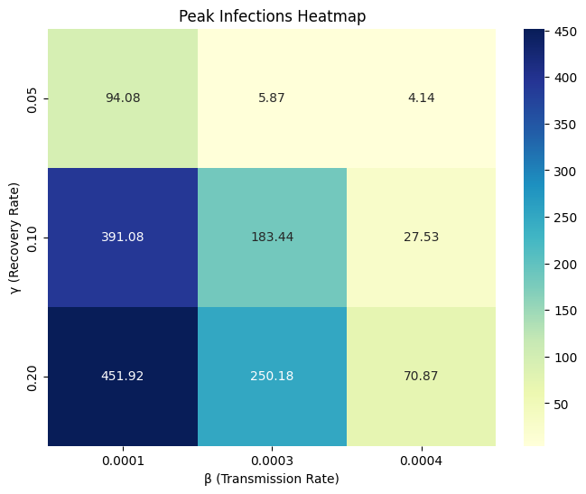

<h1 align="center">An Introduction to Model-based Machine Learning – Homework</a></h1>
<h5 align="center">Submitted as part of BMI 500 Coursework (Week 11) at Emory University</h5>
<h5 align="center">Submitted by Swati Rajwal</h5>
<h5 align="center">

# 🎯Introduction
- Name & Contact: Swati Rajwal (swati.rajwal@emory.edu)
- The question number you select to answer: 1 
- Report submitted on Canvas ([Read the report](https://github.com/swati-rajwal/BMI500_week11/blob/main/Rajwal_BMI500_HW11.pdf))
# 📈Key Insights
- The SIR and SEIR models effectively simulate pandemic dynamics and shows epidemic curves with initial peaks and subsequent declines in infection rates.
- The basic reproduction number ($R_0$), transmission ($\beta$) and recovery ($\gamma$) rates are critical in shaping infection curves.
- Lower $\beta$ values (one option: through social distancing) and higher $\gamma$ values (one option: through medical intervention) can significantly reduce both peak and total infections.

  

<b>Figure 1:  Peak infection over a year for each β and γ combination.</b>

# 👩‍💻Comparative Model Performance
- Compared to SIR, the SEIR model provides a more realistic simulation by incorporating an "Exposed" compartment, introducing a delay in infection spread. It also accounts for birth and death rates, allowing for long-term cyclical dynamics.
- During the sensitivity analysis, it was found that analysis of $\beta$ and $\gamma$ combinations highlights that lower transmission and higher recovery rates are optimal for minimizing infection spread and impact on healthcare systems. This information is valuable for feature selection and dimensionality reduction in machine learning models [5].

# 📌Relevance to Model-based Machine Learning
- While implementing and simulating these epidemic models, I found that they are very useful in demonstrating the effectiveness of mathematical frameworks in simulating real-world disease dynamics. It provides useful insights for data-driven decision-making in public health. Studies have also used SIR and SEIR frameworks as a basis for developing optimization problems to determine effective vaccine distribution strategies [6].
- Sensitivity analyses offer a structured approach to assess the impact of varying parameters that align with model-based machine learning principles to enhance model robustness and applicability.

# 💭Suggestions for future modeling improvements
- The basic modeling improvement would be to add more compartments (already vaccinated individuals) to simulate different intervention strategies.
- Researchers [7] have also shown that we need to incorporate additional factors like government policies, individual behaviors, and spatial spread into epidemic models. So, SEIR or SIR model may not be sufficient. Machine learning methods are well-suited to handle these multifaceted inputs.
- For future modeling improvement, bayesian inference techniques for parameter estimation and uncertainty quantification can also be explored as has been explored[8].

# 📚References
1. R. Sameni, "Model-Based Prediction and Optimal Control of Pandemics by Non-Pharmaceutical Interventions," in IEEE Journal of Selected Topics in Signal Processing, vol. 16, no. 2, pp. 307-317, Feb. 2022, doi: 10.1109/JSTSP.2021.3129118.
2. Sameni, R. (2020). Mathematical Modeling of Epidemic Diseases; A Case Study of the COVID-19 Coronavirus. ArXiv. https://arxiv.org/abs/2003.11371
3. Sameni, R., & Alphanumerics Lab. EpidemicModeling [Computer software]. GitHub. https://github.com/alphanumericslab/EpidemicModeling
4. https://en.wikipedia.org/wiki/Basic_reproduction_number
5. https://www.ncbi.nlm.nih.gov/books/NBK126178/
6. Hou Y, Bidkhori H. Multi-feature SEIR model for epidemic analysis and vaccine prioritization. PLoS One. 2024 Mar 1;19(3):e0298932. doi: 10.1371/journal.pone.0298932. PMID: 38427619; PMCID: PMC10906911.
7. Moein, S., Nickaeen, N., Roointan, A. et al. Inefficiency of SIR models in forecasting COVID-19 epidemic: a case study of Isfahan. Sci Rep 11, 4725 (2021). https://doi.org/10.1038/s41598-021-84055-6
8. A. Tasciotti, F. Urban, F. de Dea, L. Bortolussi, G. Caravagna and A. D'Onofrio, "Deep Learning-Informed Bayesian Model-Based Analysis to Estimate Superspreading Events in Epidemic Outbreaks," in IEEE Access, vol. 12, pp. 161375-161400, 2024, doi: 10.1109/ACCESS.2024.3490374.

# ⚠️Disclaimer
- Perplexity.ai was used to complete HW #1.C to understand the concept of the basic reproductive number
- Perplexity.ai was used to find resources to understand SIR and SEIR's relevance to model-based machine learning.
